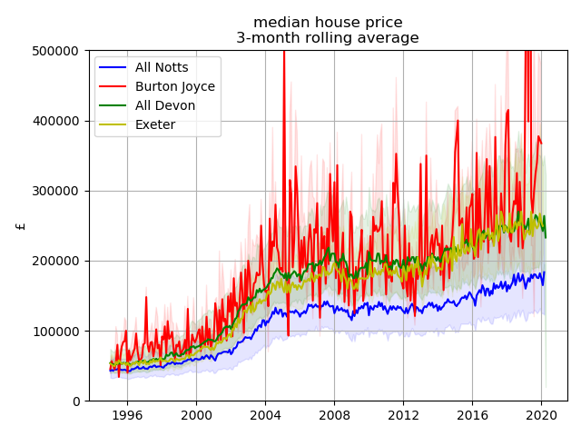

# UK House Price Time-series by Region

The `house_price_analysis.py` script ingests house-level 
houseprice data and aggregates into a daily 
timeseries by UK geographic region. Current regions include the picturesque 
Nottinghamshire village of Burton Joyce, all of Nottinghamshire itself, 
Exeter and all Devon areas. Further analysis to follow.

## Data Source

The data is too large for this repo but is available from 
HM land registry [here](https://landregistry.data.gov.uk/app/ppd).

## Output

